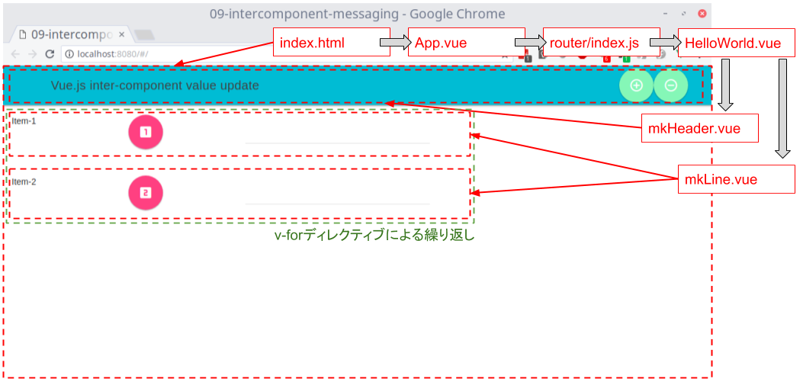
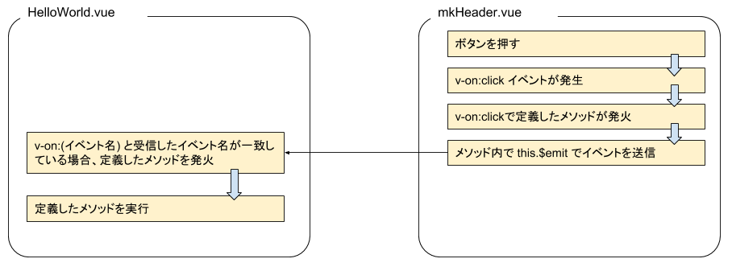

# 09-intercomponent-messaging

Vue.js を使う醍醐味として動的にコンポーネントを生成したり、値の受け渡しでコンポーネントの再利用をするなどがあるのでやってみた。

# まずCodepenでやってみた

https://codepen.io/mkiuchi/pen/jpgoJp

それぞれのVueインスタンスが変数となっている場合わりと隣接するコンポーネントへのアクセスは簡単で、`<変数名>.<v-modelで宣言したプロパティ名>` でできてしまう。ただこれだと `vue init` で作成するようなものと少し乖離が出てしまって実際どうなのよ的なモヤモヤ感が残るところはあるのでせっかくの休みでもあるので。

# 実際のVue.jsプロジェクトで再実装する

`vue init webpack <プロジェクトのディレクトリ>` でプロジェクトを作成

# 概要の説明

デフォルトから変えたものを(*)で図示。完全な成果物は XXX から取得することができる。

```shell
.
├── README.md
├── build
│   ├── build.js
│   ├── check-versions.js
│   ├── logo.png
│   ├── utils.js
│   ├── vue-loader.conf.js
│   ├── webpack.base.conf.js
│   ├── webpack.dev.conf.js
│   └── webpack.prod.conf.js
├── config
│   ├── dev.env.js
│   ├── index.js
│   ├── prod.env.js
│   └── test.env.js
├── (*) index.html
├── node_modules
│   └── (略)
├── package-lock.json
├── package.json
├── src
│   ├── (*) App.vue
│   ├── assets
│   │   └── logo.png
│   ├── components
│   │   ├── (*) HelloWorld.vue
│   │   ├── (*) mkHeader.vue
│   │   └── (*) mkLine.vue
│   ├── main.js
│   └── router
│       └── index.js
├── static
└── test
    ├── e2e
    │   ├── custom-assertions
    │   │   └── elementCount.js
    │   ├── nightwatch.conf.js
    │   ├── runner.js
    │   └── specs
    │       └── test.js
    └── unit
        ├── jest.conf.js
        ├── setup.js
        └── specs
            └── HelloWorld.spec.js
```

とりあえずイメージをつかむために、成果物を `npm run dev` したスクリーンショットで構成を説明。



論理的な構造、呼び出し順序としては以下のようになっている。

```text
index.html
└─ App.vue
     └─ router/index.js
          └─ HelloWorld.vue
               ├─ mkHeader.vue
               └─ mkLine.vue
```

まず `index.html` が呼び出され、そこから Vur.js の rootコンポーネントである `App.vue` が呼び出される。

`App.vue` は `<router-view/>` タグの中で vue-router を動作させ、指定されたページである `HelloWorld.vue` を呼び出す。

`HelloWorld.vue` はMDLのレイアウトになっており、内部でヘッダー部(`mdl-layout--header`)とコンテンツ部(`mdl-layout--content`)を定義し、ヘッダー部には `mkHeader.vue` で定義されたコンポーネントを埋め込んでいる。コンテンツ部には vue.js の `v-for` ディレクティブを使用して、`mkLine.vue` コンポーネントを複数埋め込んでいる。

# コンポーネントの埋め込み(src/components/HelloWorld.vue, src/components/mkHeader.vue, src/components/mkLine.vue)

Vue.js の目玉機能の1つであるコンポーネントの再利用について記述する。

まず埋め込むためのコンポーネントを作成する。まず `mkHeader.vue` を見てみる。

```html
<template>
  <!-- ヘッダー -->
  <header class="mdl-layout__header">
    <div class="mdl-layout__header-row">
      <!-- タイトル文 -->
      <span class="mdl-layout-title">Vue.js inter-component value update</span>

      <!-- スペーサーを入れて後ろのナビゲーション部を右寄せにする -->
      <div class="mdl-layout-spacer"></div>

      <!-- ナビゲーション部 -->
      <nav class="mdl-navigation">
        <!-- リストに要素を追加するボタン -->
        <button class = "mdl-button mdl-js-button mdl-button--fab mdl-js-ripple-effect mdl-button--colored" id="addbutton" style="background-color:#85f7b7;" v-on:click="add()"><i class = "material-icons">add_circle_outline</i><span class="mdl-tooltip" data-mdl-for="addbutton">要素を追加</span></button>

        <!-- リストから要素を削除するボタン -->
        <button class = "mdl-button mdl-js-button mdl-button--fab mdl-js-ripple-effect mdl-button--colored" id="removebutton" style="background-color:#85f7b7;" v-on:click="remove()"><i class = "material-icons">remove_circle_outline</i><span class="mdl-tooltip" data-mdl-for="removebutton">要素を削除</span></button>
      </nav>
    </div>
  </header>
</template>

<script>
export default {
  name: 'mkHeader',
  methods: {
    add: function () {
      // 親コンポーネント(HelloWorld.vue)にイベントを送信
      this.$emit('additem')
    },
    remove: function () {
      // 親コンポーネント(HelloWorld.vue)にイベントを送信
      this.$emit('removeitem')
    }
  }
}
</script>
```

ここではコンポーネント再利用のための特殊な記述は特にはない。

続けて再利用する側である `HelloWorld.vue` を見てみる。

```html
<template>
  <div class="hello mdl-layout mdl-js-layout mdl-layout--fixed-header">
    <!--子コンポーネントからのイベントを v-on:(イベント名)="(実行するメソッド)" で捕捉 -->
    <mkheader v-on:additem="additem()" v-on:removeitem="removeitem()"></mkheader>
    <main class="mdl-layout__content">
      <div v-for="item of items" :key="item.number">
        <mkline v-bind:row="item.number"></mkline>
      </div>
    </main>
  </div>
</template>

<script>
import mkHeader from "./mkHeader.vue"
import mkLine from "./mkLine.vue"

export default {
  name: 'HelloWorld',
  components: {
    'mkheader': mkHeader,
    'mkline': mkLine
  },
  data () {
    return {
      msg: 'Welcome to Your Vue.js App',
      numitem: 2,
      items: [
        { number: 1 },
        { number: 2 }
      ]
    }
  },
  methods: {
    additem: function () {
      console.log("add-item event received")
      var newnumber = this.numitem + 1
      this.items.push({ number: newnumber })
      this.numitem = newnumber
    },
    removeitem: function () {
      console.log("remove-item event received")
      this.items.pop()
      this.numitem = this.numitem - 1
    }
  }
}
</script>

<style>
</style>
```

まずscript部の冒頭で必要とするコンポーネントをimport文でロードする。これだけではコンポーネントを使用することはできない。

つづいて components の中に使用したいコンポーネントのタグ名を定義する。たぶん正確には違う(おそらくインスタンスを生成する？)とは思うが、まずはこういう理解で問題なさそう。

最後に HTML 部のなかでタグのように `<mkheader></mkheader>` として記述すると、その部分に定義したコンポーネントが埋め込まれることになる。

# v-forによるコンポーネントの連続的な生成

つづけて v-for ディレクティブによるコンポーネントの連続的な生成について記述する。

改めて生成する側である `HelloWorld.vue` の該当部を抜粋する。

```html
    <main class="mdl-layout__content">
      <div v-for="item of items" :key="item.number">
        <mkline v-bind:row="item.number"></mkline>
      </div>
    </main>
</template>

<script>
export default {
  data () {
    return {
      items: [
        { number: 1 },
        { number: 2 }
      ]
    }
  }
}
</script>
```

まずdata部の中に、配列を有するデータを定義する。上記の例では `items` がそれになる。

続けて繰り返したいタグ(liやdivなど)の中に `v-for="(各要素の変数名) in (配列名)` の形式で繰り返し宣言をする。また 各要素を一意にするため `key` 属性をあわせて定義する必要がある。

また生成対象(今回の場合は `<mkline>` )には、 `v-bind:(プロパティ名)="(割り当てる変数名)"` で値を渡すことができる。これを受け取った後の処理については後述する。

繰り返し回数を増減するためには、配列変数(この場合は `items`)に対して、`push()`, `pop()` などのメソッドを使用することになる。使用例もこのサンプルの中に記述しているので合わせて参照されたい。

次に生成される側の処理について記述する。生成される側である `mkLine.vue` の該当分を見てみる。

```html
<template>
  <div class="mdl-grid">
    <div class="mdl-cell mdl-cell--2-col graybox">
      Item-{{ row.toString() }}
    </div>
    <div class="mdl-cell mdl-cell--2-col graybox">
        <button class = "mdl-button mdl-js-button mdl-button--fab mdl-js-ripple-effect mdl-button--colored" v-on:click="clicked()"><i class = "material-icons">{{ thisrow }}</i></button>
    </div>
    <div class="mdl-cell mdl-cell--4-col graybox">
      <div class="mdl-textfield mdl-js-textfield">
        <input class = "mdl-textfield__input" type="text" v-model="textval"/>
      </div>
    </div>
  </div>
</template>

<script>
export default {
  name: 'mkLine',
  data () {
    return {
      textval: '',
      thisrow: ''
    }
  },
  props: ['row'],
  mounted: function () {
    console.log(this.row)
    console.log(this.$options.name)
    console.log(this._uid)
    if (this.row === 1) {
      this.thisrow = 'looks_one'
    } else if (this.row === 2) {
      this.thisrow = 'looks_two'
    } else if (this.row === 3) {
      this.thisrow = 'looks_3'
    } else if (this.row === 4) {
      this.thisrow = 'looks_4'
    } else if (this.row === 5) {
      this.thisrow = 'looks_5'
    } else if (this.row === 6) {
      this.thisrow = 'looks_6'
    } else {
      this.thisrow = 'add_box'
    }
  }
}
</script>
```

まず生成する側からプロパティとして渡される値を `props` のなかで定義する。今回の場合は `row` になる。こうすることでプロパティはこのコンポーネントの中の変数として扱うことができるようになる。

HTML部では `{{ (プロパティ名)) }}` として埋め込むことができるし、javascript部では `this.(プロパティ名)` として値を参照することができる。この例では mounted イベント、つまりコンポーネントが構成され表示される前の処理にプロパティ値を使用している。

# 子コンポーネントから親コンポーネントへのイベント送信

イベントの送受信は日本語の資料があまり見かけないため少し手間がかかった。

まず原則として、親⇒子、子⇒親という単方向のイベント送信しかサポートされていない。例えば 子⇒別の子 というようなイベント送信はサポートされておらず、 子⇒親⇒別の子 というような多段のイベント送信は自前で実装する必要がある。

改めて子コンポーネントである `mkHeader.vue` を見てみる。

```html
<template>
  <!-- ヘッダー -->
  <header class="mdl-layout__header">
    <div class="mdl-layout__header-row">
      <!-- タイトル文 -->
      <span class="mdl-layout-title">Vue.js inter-component value update</span>

      <!-- スペーサーを入れて後ろのナビゲーション部を右寄せにする -->
      <div class="mdl-layout-spacer"></div>

      <!-- ナビゲーション部 -->
      <nav class="mdl-navigation">
        <!-- リストに要素を追加するボタン -->
        <button class = "mdl-button mdl-js-button mdl-button--fab mdl-js-ripple-effect mdl-button--colored" id="addbutton" style="background-color:#85f7b7;" v-on:click="add()"><i class = "material-icons">add_circle_outline</i><span class="mdl-tooltip" data-mdl-for="addbutton">要素を追加</span></button>

        <!-- リストから要素を削除するボタン -->
        <button class = "mdl-button mdl-js-button mdl-button--fab mdl-js-ripple-effect mdl-button--colored" id="removebutton" style="background-color:#85f7b7;" v-on:click="remove()"><i class = "material-icons">remove_circle_outline</i><span class="mdl-tooltip" data-mdl-for="removebutton">要素を削除</span></button>
      </nav>
    </div>
  </header>
</template>

<script>
/* eslint-disable */
export default {
  name: 'mkHeader',
  methods: {
    add: function () {
      // 親コンポーネント(HelloWorld.vue)にイベントを送信
      this.$emit('additem')
    },
    remove: function () {
      // 親コンポーネント(HelloWorld.vue)にイベントを送信
      this.$emit('removeitem')
    }
  }
}
</script>
```

特筆するのは各ボタンに記述した `v-on:click="add()"`, `v-on:click="remove()"` 定義と、この定義によって発火する、addメソッドとremoveメソッド。

add, removeメソッド内に定義されている `this.$emit` によって親コンポーネントに向けてイベントを送信することができる。

そして受信側の `HelloWorld.vue` では `v-on:additem="additem()"` によって子コンポーネントからのイベントによってメソッドを発火させることができる。



受信側の `HelloWorld.vue` を見てみる。 `mkheader` タグに定義された `v-on:additem="additem()"`, `v-on:removeitem="removeitem()"` が受信側の定義になる。 `v-on:(イベント名)` で受信すべきイベント名を定義し、`="(メソッド名)"` でイベント受信時に発火させるイベント名を定義する。

最後に javascript 部に method として発火させるイベントを記述している。

```html
<template>
  <div class="hello mdl-layout mdl-js-layout mdl-layout--fixed-header">
    <!--子コンポーネントからのイベントを v-on:(イベント名)="(実行するメソッド)" で捕捉 -->
    <mkheader v-on:additem="additem()" v-on:removeitem="removeitem()"></mkheader>
    <main class="mdl-layout__content">
      <div v-for="item of items" :key="item.number">
        <mkline v-bind:row="item.number"></mkline>
      </div>
    </main>
  </div>
</template>

<script>
import mkHeader from "./mkHeader.vue"
import mkLine from "./mkLine.vue"

export default {
  name: 'HelloWorld',
  components: {
    'mkheader': mkHeader,
    'mkline': mkLine
  },
  data () {
    return {
      msg: 'Welcome to Your Vue.js App',
      numitem: 2,
      items: [
        { number: 1 },
        { number: 2 }
      ]
    }
  },
  methods: {
    additem: function () {
      console.log("add-item event received")
      var newnumber = this.numitem + 1
      this.items.push({ number: newnumber })
      this.numitem = newnumber
    },
    removeitem: function () {
      console.log("remove-item event received")
      this.items.pop()
      this.numitem = this.numitem - 1
    }
  }
}
</script>

<style>
</style>
```

